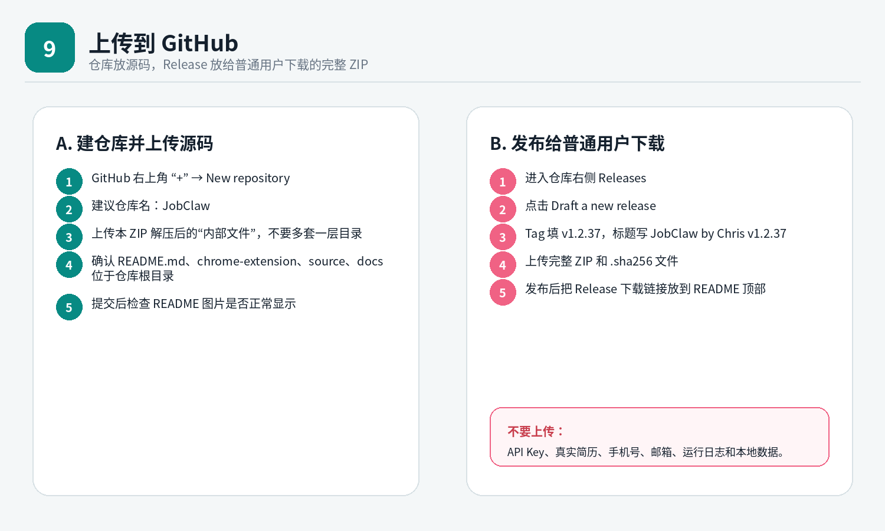

# JobClaw by Chris

面向求职者的 BOSS 直聘 AI 求职助手。它可以读取简历、生成职业画像、让用户自主选择投递方向、自动搜索并排序岗位，并支持人工确认或全自动沟通。

> 当前版本：`v1.2.37`  
> 联系方式：微信 `easymoneysniperchris`


## 先看结论

这个目录已经按 GitHub 仓库结构整理好，可以直接上传。仓库根目录中已经包含：

- 可直接加载的 Chrome 扩展：`chrome-extension/`
- 可修改和构建的源代码：`source/`
- macOS 桌面桥接：`desktop-bridge/`
- 零基础步骤图：`docs/images/`
- 常见问题、安全说明、贡献说明和 Issue 模板

上传 GitHub 时，请上传本目录里的全部内容，让 `README.md`、`chrome-extension`、`source` 和 `docs` 直接位于仓库根目录。不要只上传 `chrome-extension`，也不要把整个目录再额外套一层。

## 它能做什么

- 导入 PDF、DOCX、TXT 简历并保留可编辑正文
- 使用 AI 生成职业画像
- 由用户自主选择、修改和排序投递岗位方向
- 根据已选方向生成 BOSS 搜索任务
- AI 分析岗位并自动排序
- 支持人工确认和全自动投递
- 显示每个搜索任务、每个岗位的独立进度
- 跳过外部网申岗位
- 失败任务支持打开、重试和忽略
- 可选 OpenClaw 本地桥接，用于 OCR、日报和任务恢复

## 使用前准备

### 必需

- 一台安装了 Chrome 的电脑
- 已登录的 BOSS 直聘网页账号
- 一个可用的 AI API Key，例如 DeepSeek API Key
- 一份自己的简历

### 可选

- macOS + Node.js 20 或更高版本：用于安装 OpenClaw 桌面桥接

普通的浏览器搜索、分析和投递不要求安装 OpenClaw。扫描版 PDF、本地 OCR、日报和任务恢复才需要它。

---

# 零基础安装教程

## 第 1 步：下载并解压

建议普通用户从 GitHub 的 **Releases** 页面下载完整 ZIP，而不是下载 GitHub 自动生成的 Source code ZIP。

下载后双击解压，确保能看到：

```text
JobClaw-by-Chris-v1.2.37/
├── chrome-extension/
├── desktop-bridge/
├── docs/
├── source/
├── README.md
└── 安装桌面桥接-mac.command
```

## 第 2 步：加载 Chrome 扩展


1. 在 Chrome 地址栏输入：`chrome://extensions`
2. 打开右上角“开发者模式”
3. 点击“加载已解压的扩展程序”
4. 选择解压目录中的 **`chrome-extension` 文件夹**
5. 打开 BOSS 直聘网页并登录
6. 点击 Chrome 侧边栏中的 JobClaw

注意：必须选择 `chrome-extension` 文件夹，不能选择整个项目根目录，也不能选择 ZIP 文件。

## 第 3 步：配置搜索条件与 AI


进入 **设置 → 搜索与 AI**：

1. 选择执行模式：人工确认或全自动投递
2. 填写目标城市、求职类型、工作经验、学历和薪资条件
3. 找到 AI 模型连接
4. 默认 Base URL：`https://api.deepseek.com`
5. 默认模型：`deepseek-v4-pro`
6. 填入自己的 API Key
7. 点击“测试 AI 连接”
8. 显示“连接正常”后点击“保存设置”

API Key 只应填写在自己电脑上的扩展设置中，不要提交到 GitHub、截图或 Issue。

## 第 4 步：导入简历


进入 **简历 → 简历原文**：

1. 点击“浏览”选择简历
2. 等待系统识别正文
3. 检查姓名、教育、项目、技能等内容是否完整
4. 识别不准确时直接修改或粘贴正文
5. 保存简历原文

PDF 使用特殊字体或扫描图片时，浏览器可能无法直接提取。这时可以安装 OpenClaw 使用本地 OCR，或者改用 DOCX/TXT。

## 第 5 步：生成并修改职业画像


进入 **简历 → 职业画像**：

- 检查个人定位摘要
- 检查主要求职方向
- 检查岗位搜索词
- 检查核心技能
- 检查城市、经验、学历和薪资条件

AI 生成的内容只是初稿。任何不准确、夸大或不存在的经历都必须删除。JobClaw 的招呼语只应使用简历和岗位中的真实事实。

## 第 6 步：选择要投递的岗位方向


职业画像生成后，会出现“选择要投递的岗位方向”：

- 默认只启用匹配度最高的 3 个方向
- 可以取消不想投递的岗位
- 可以修改岗位名称和搜索关键词
- 可以调整优先级
- 可以增加自定义岗位
- 点击“保存并应用到新搜索任务”后才会生效

系统只会搜索你明确勾选并保存的方向，不会把职业画像中出现的所有可能岗位都自动加入投递。

## 第 7 步：选择模式并开始


### 人工确认

AI 完成筛选和招呼语生成后，岗位进入待确认队列。你可以逐条检查、修改和确认。

### 全自动投递

达到推荐分数的岗位会自动沟通。遇到验证、页面异常、聊天对象不确定或发送结果无法确认时，系统会暂停。

第一次使用时，建议：

1. 先使用人工确认，或只重试一个岗位
2. 检查文字是否真实出现在右侧聊天气泡
3. 检查简历附件是否按设置发送
4. 检查完成后是否返回职位页继续搜索
5. 单条通过后再开启批量全自动

## 第 8 步：查看进度和失败任务


消息页会显示：

- 当前步骤和百分比
- 岗位、公司和匹配分数
- 发送文字、附件和验证结果
- 失败原因和重试次数

失败任务可以：

- 打开原岗位
- 重新投递
- 忽略
- 全部重试失败任务

不要连续多次点击“重新投递”。同一个任务正在执行时，应等待状态更新。

## 第 9 步：OpenClaw（可选）


OpenClaw 是本地执行与恢复中心，适合以下情况：

- 扫描版 PDF 或特殊字体 PDF 需要 OCR
- 希望读取本地求职日报
- 希望恢复本地失败任务
- 希望浏览器关闭后保留更多本地状态

### macOS 安装

1. 确认已经安装 Node.js 20 或更高版本
2. 在 Finder 中找到 `安装桌面桥接-mac.command`
3. 按住 Control 点击文件，选择“打开”
4. macOS 再次询问时选择“打开”
5. 返回 JobClaw → OpenClaw → 点击“检测连接”

如果 macOS 提示无法验证开发者，请确认文件来自本仓库后，到：

```text
系统设置 → 隐私与安全性 → 仍要打开
```

OpenClaw 数据默认保存在：

```text
~/.jobclaw/
```

---

# 常见问题

## 1. “加载扩展程序失败”

检查：

- 是否选择了 `chrome-extension` 文件夹
- 文件夹内是否直接存在 `manifest.json`
- 是否打开开发者模式
- 是否把 ZIP 直接拿去加载了

正确目录：

```text
chrome-extension/
├── manifest.json
├── background.js
├── sidepanel.html
└── ...
```

## 2. 安装新版后还是旧界面或旧错误

1. 在 JobClaw 中点击“停止”
2. 到 `chrome://extensions` 点击扩展卡片上的刷新按钮
3. 关闭全部旧 BOSS 职位页和聊天页
4. 重新打开 BOSS
5. Chrome 会保留旧错误记录，可在错误页面点击“全部清除”后再测试

## 3. AI 测试显示连接正常，但画像生成失败

连接正常只代表接口可访问。画像生成仍可能因为输出被截断、返回格式不完整或模型名不可用而失败。

处理顺序：

1. 确认模型名称正确
2. 重新点击“从简历重建初稿”
3. 检查 API 余额和调用限制
4. 使用默认 Base URL 和默认模型测试
5. 导出诊断时先确认 API Key 已被隐藏

## 4. 简历 PDF 识别乱码或为空

- 优先使用 DOCX 或 TXT
- PDF 是扫描图片时安装 OpenClaw OCR
- 可以直接粘贴简历正文
- 不要将乱码保存到职业画像

## 5. “开始采集”按钮不能点击

启动检查必须完成：

- 已保存简历原文
- 已保存职业画像
- 已配置并测试 AI
- 已选择并保存投递岗位方向
- 当前打开的是 BOSS 页面

## 6. 找到岗位但详情一直加载失败

- 刷新当前 BOSS 页面
- 检查是否登录失效
- 检查岗位是否已经关闭
- 外部网申岗位会自动跳过
- 单个岗位异常不会代表整个搜索失败

## 7. 招呼语没有真正发出去

全自动前先做单条测试。确认：

- 左侧选中的是目标 HR
- 右侧出现完整文字气泡，而不是只有输入框草稿
- 没有验证码、安全验证或登录弹窗
- 页面没有停留在空白聊天占位画面

文字气泡未确认时，系统不应发送图片、计入成功或继续下一个岗位。

## 8. 只发了简历图片，没有发文字

先关闭“发送简历图片”，只测试文字；文字发送稳定后再重新开启附件。消息页中必须先出现“文字已确认发送”，才能进入附件步骤。

## 9. 投递速度太快

在设置中提高：

- 岗位切换间隔
- 文字确认后附件等待时间

建议使用保守速度，并遵守平台规则。不要以骚扰、重复发送或绕过验证为目的使用本项目。

## 10. 同一个 HR 被重复投递

立即停止任务并检查消息页。不要继续批量重试。打开失败任务确认岗位、公司和 HR 是否正确，再单条重试。

## 11. OpenClaw 显示未连接

- 确认安装脚本已经成功运行
- 点击“检测连接”
- 检查 Node.js 是否安装
- 查看日志：`~/.jobclaw/bridge-error.log`
- 端口 `17899` 被占用时，停止占用该端口的程序后重新安装

## 12. macOS 把安装脚本拦截了

不要点击“移到废纸篓”。先点“完成”，然后：

1. 系统设置 → 隐私与安全性
2. 找到被阻止的安装脚本
3. 点击“仍要打开”

或者在 Finder 中按住 Control 点击脚本，再选择“打开”。

## 13. API Key、简历和日志会不会上传到 GitHub

不会自动上传。只有你自己把这些文件提交到仓库时才会公开。

请勿上传：

- API Key
- 真实简历文件和简历截图
- 手机号、邮箱、身份证、家庭地址
- `.jobclaw` 本地数据
- 运行日志和诊断文件

AI 功能会把用于分析的简历文本、职业画像或岗位信息发送给你配置的模型服务商。使用前请阅读该服务商的隐私政策。

---

# GitHub 上传与发布



## 上传源码仓库

1. 在 GitHub 新建仓库，建议名称：`JobClaw`
2. 上传本目录的内部文件
3. 确保 `README.md` 位于仓库根目录
4. 确保 `docs/images` 一起上传，否则 README 步骤图无法显示
5. 不要上传自己的 API Key、简历和日志

## 发布给普通用户下载

建议创建 Release：

- Tag：`v1.2.37`
- 标题：`JobClaw by Chris v1.2.37`
- 附件：完整 ZIP
- 附件：对应 `.sha256` 校验文件

普通用户下载 Release ZIP 后，按 README 的“零基础安装教程”操作即可。

## 怎么替换或增加 README 图片

所有图片统一放在：

```text
docs/images/
```

README 中这样引用：

```markdown

```

替换图片时保持原文件名，GitHub 页面会自动更新。新增图片时，使用英文小写文件名和连字符，例如：

```text
docs/images/10-new-feature.png
```

不要在公开截图中出现 API Key、手机号、邮箱、真实简历正文或招聘者私人信息。

---

# 开发者说明

## 目录结构

```text
chrome-extension/   可直接加载的构建结果
source/src/          扩展源代码
source/public/       HTML、CSS、Manifest
source/tests/        回归测试
source/dist/         构建输出
desktop-bridge/      OpenClaw 本地桥接
docs/                用户文档与步骤图
skills/              JobClaw Skill 说明
```

## 本地测试与构建

需要 Node.js 20 或更高版本：

```bash
cd source
npm test
npm run build
```

构建结果位于：

```text
source/dist/chrome-extension/
```

## 安全说明

- 桌面桥接只监听 `127.0.0.1:17899`
- 桌面桥接只允许当前 JobClaw 扩展来源访问
- 仓库中不包含默认 API Key
- 诊断导出会隐藏模型 API Key
- 扩展使用 `debugger` 权限是为了对 BOSS 聊天框执行可信输入与发送验证
- 扩展使用 `clipboardWrite` 权限是为了将招呼语真实写入受控聊天编辑器

更详细内容见：[隐私与安全](docs/隐私与安全.md)

## 免责声明

本项目用于辅助求职者整理简历、筛选岗位和管理投递流程。使用者应自行检查岗位、招呼语和投递结果，并遵守 BOSS 直聘及所在地区的法律、规则和平台条款。项目不保证获得回复、面试或录用，也不应被用于骚扰、刷量、重复发送或绕过平台验证。

## 许可证

当前仓库未附带开源许可证，默认保留全部权利。商用、二次分发或大规模部署请先联系作者。

## 联系作者

- 微信：`easymoneysniperchris`
- 提交 Bug：优先使用 GitHub Issues，并附上脱敏后的截图和诊断信息
