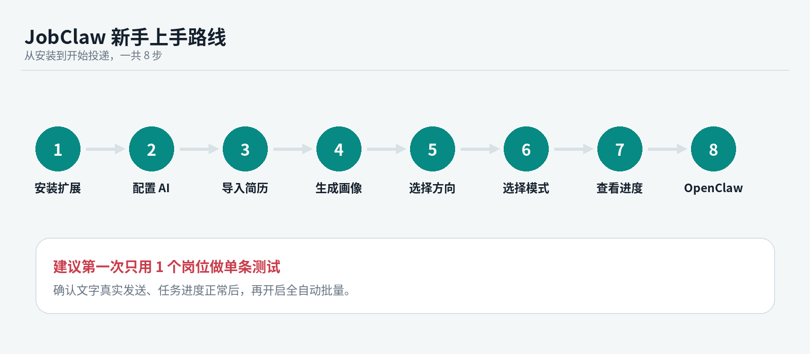
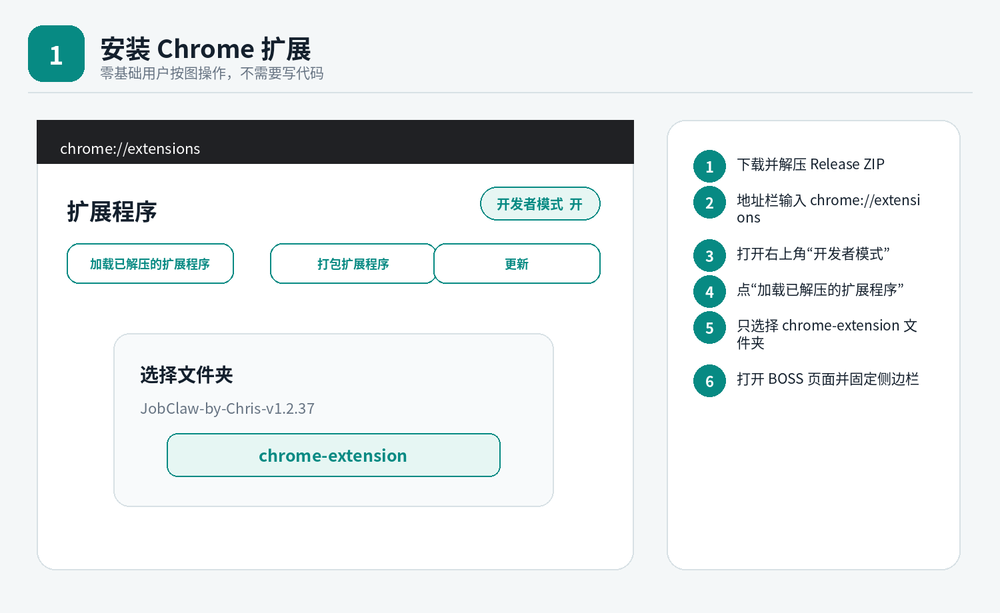
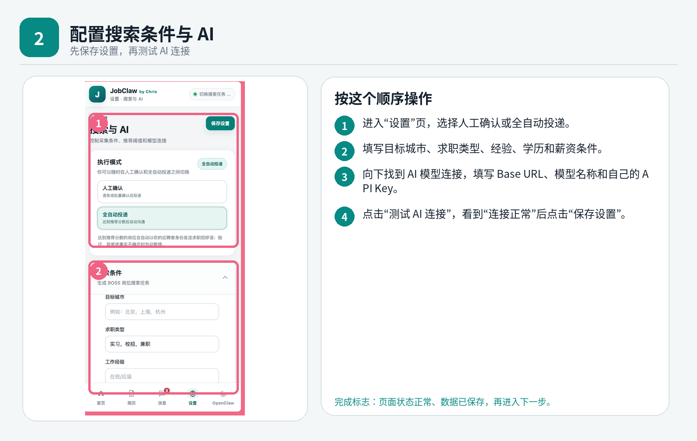
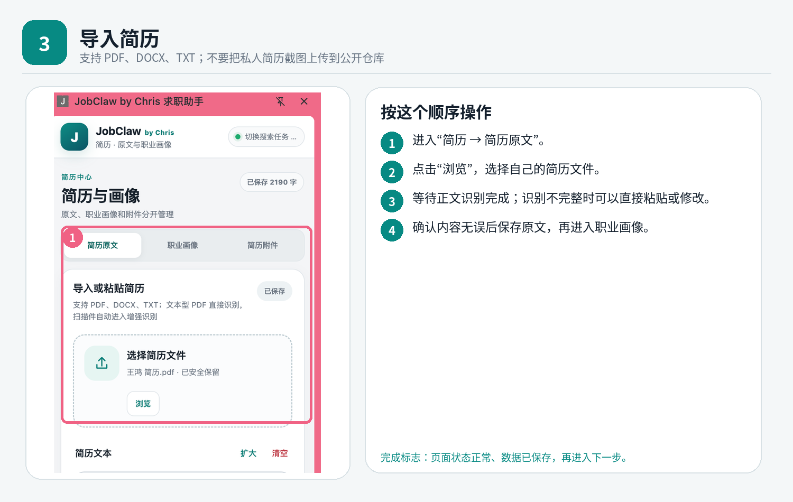
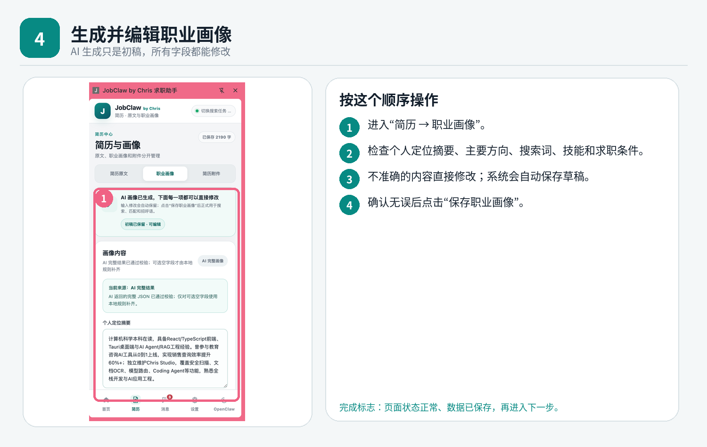
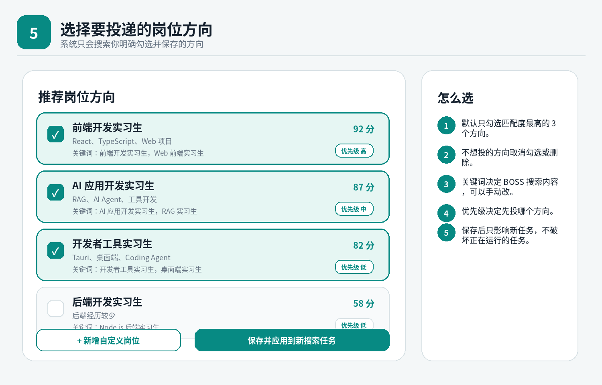
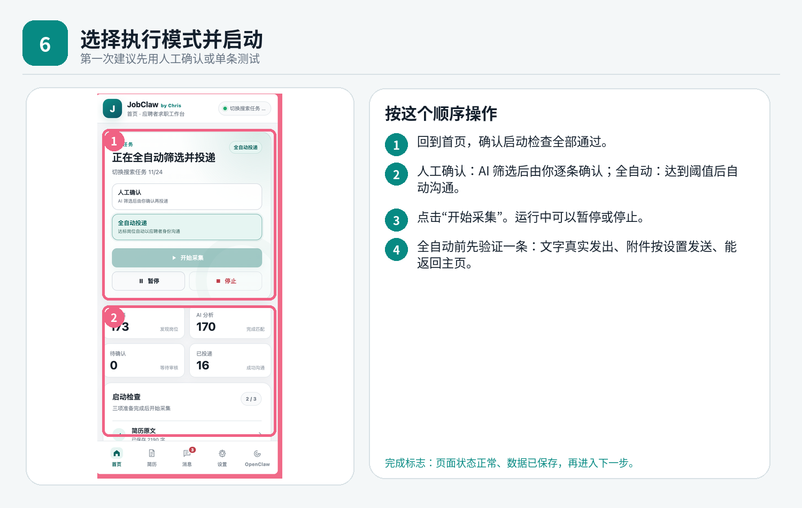
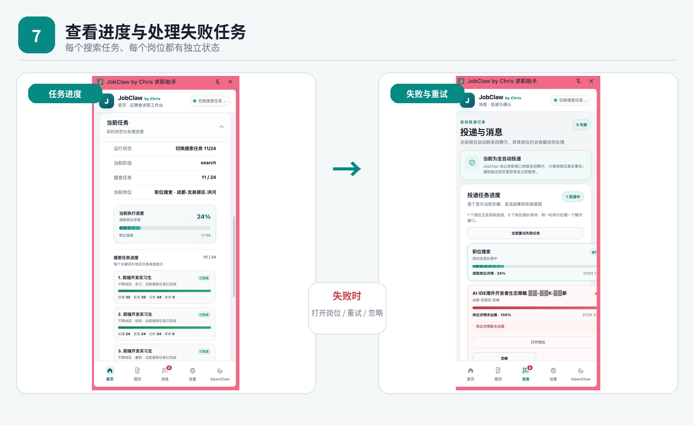
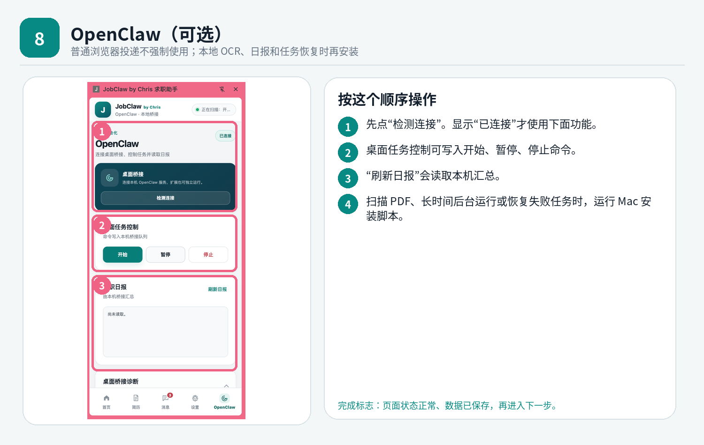

<div align="center">

# JobClaw by Chris

**面向求职者的本地 AI 投递助手**

从简历解析、职业画像和岗位方向选择，到岗位信息整理、AI 匹配排序、沟通草稿生成与投递进度管理，集中在一个 Chrome 侧边栏中完成。

[快速开始](#快速开始) · [功能介绍](#核心功能) · [使用边界](#安全与使用边界) · [完整教程](docs/新手安装与使用.md) · [常见问题](docs/常见问题.md) · [隐私与安全](docs/隐私与安全.md)


</div>

> JobClaw 是由用户主动控制的求职信息整理与投递辅助工具，不属于任何招聘平台的官方产品，也不代表任何平台提供授权、合作或背书。使用者应遵守适用法律、目标网站规则及账号使用要求。



## JobClaw 是什么

求职过程中，用户通常需要反复查看岗位要求、判断匹配程度、整理沟通内容、记录投递状态并处理失败任务。

JobClaw 将这些环节整理为一条清晰流程：

```text
导入简历
  → AI 生成职业画像
  → 自主选择投递方向
  → 整理用户选择的岗位信息
  → AI 匹配与优先级排序
  → 人工确认 / 自动辅助
  → 查看进度与处理异常
```

系统始终以**求职者 / 应聘者**身份工作。职业画像、岗位判断和沟通内容必须基于用户简历与岗位页面中存在的真实信息，不应虚构经历、技能、学历、薪资、到岗时间或其他事实。

JobClaw 的目标是帮助用户减少重复整理工作，而不是替代用户作出求职决定。AI 输出仅作为辅助建议，重要内容应由用户核对后使用。

## 核心功能

| 模块 | 能力 |
| --- | --- |
| 简历中心 | 导入 PDF、DOCX、TXT，保留可编辑的简历原文 |
| 职业画像 | 根据教育、项目、技能和求职条件生成可编辑画像 |
| 投递方向 | 自主勾选岗位方向、修改搜索词、调整优先级、添加自定义方向 |
| 岗位整理 | 根据用户保存的方向建立任务，读取并整理用户主动打开或明确选择的岗位信息 |
| AI 匹配 | 分析岗位要求，给出匹配分、判断理由、技能命中、能力缺口和待确认项 |
| 智能排序 | 综合匹配度、硬性条件、地点、薪资、新鲜度和风险提示进行排序 |
| 执行模式 | 支持人工确认，也支持由用户主动启用的自动辅助模式 |
| 沟通草稿 | 根据简历证据和岗位要求生成可编辑的应聘沟通内容 |
| 任务进度 | 每个任务和岗位均可显示独立进度、阶段、结果和异常原因 |
| 失败恢复 | 异常任务可重新打开、单条重试、标记忽略或由用户继续处理 |
| OpenClaw | 可选本地桥接，用于 OCR、日报、本地文件和任务状态恢复 |

## 设计原则

- **用户主动控制**：任务由用户创建、启动、暂停和停止，用户可随时检查当前岗位与沟通内容。
- **本地优先**：简历、职业画像、筛选条件和任务记录默认保存在用户自己的浏览器或本机。
- **最小必要处理**：只处理实现当前求职辅助功能所需的信息，不以建立招聘联系人数据库为目的。
- **真实信息优先**：不替用户虚构经历，不夸大能力，不自动承诺薪资、到岗时间或面试时间。
- **异常立即暂停**：出现登录异常、安全验证、账号限制、页面对象不确定或发送结果无法确认时，任务应停止并交由用户处理。
- **不对抗安全措施**：官方版本不提供验证码绕过、账号轮换、代理池、设备指纹伪装、反检测或自动恢复受限账号等能力。

## 快速开始

### 1. 下载正式包

进入仓库的 **Releases** 页面，下载最新完整 ZIP 并解压。

> 不建议普通用户使用 GitHub 自动生成的 `Source code.zip`，因为它不一定等同于已经整理好的可安装包。

### 2. 加载 Chrome 扩展



1. 在 Chrome 地址栏打开 `chrome://extensions`
2. 打开右上角“开发者模式”
3. 点击“加载已解压的扩展程序”
4. 选择解压目录中的 **`chrome-extension` 文件夹**
5. 登录自己正常使用的招聘网站账号
6. 打开岗位页面，再打开 JobClaw 侧边栏

JobClaw 不要求用户导出或上传登录 Cookie、Token 或其他会话凭证。

### 3. 完成首次配置

按下面顺序完成：

1. 在“设置”中填写自己的求职条件和 AI API Key
2. 测试 AI 连接并保存
3. 导入并核对简历原文
4. 生成、检查并编辑职业画像
5. 选择准备投递的岗位方向
6. 第一次只处理一个由自己确认的岗位

### 4. 首次执行应完成单条验收

首次使用自动辅助模式时，建议只验证一个岗位并确认：

- 当前打开的是用户选择的岗位
- 当前沟通对象与岗位信息一致
- 沟通文字基于真实简历且内容准确
- 页面中确实出现了完整发送结果
- 附件只在用户已配置且发送结果可确认时处理
- 任务状态被正确记录
- 没有出现登录异常、安全验证或账号限制

任何一步无法确认，都应立即暂停并查看原因，不要连续重复执行。详细规则见 [首次单条投递验收](docs/首次单条验收.md)。

## 使用流程

### 配置求职条件与 AI



在“设置”页选择执行模式，填写城市、求职类型、经验、学历、薪资条件及自己的 AI API Key。

API Key 只应保存在用户自己的设备中，不要提交到仓库、Issue、截图、录屏或公开日志。使用第三方模型前，请阅读相应服务商的数据与隐私规则。

### 导入简历



进入“简历 → 简历原文”上传文件。普通文本 PDF、DOCX、TXT 可直接解析；扫描版 PDF 或特殊字体 PDF 可改用粘贴正文，或通过 OpenClaw 使用本地 OCR。

请勿将身份证号码、家庭住址或与岗位匹配无关的敏感信息提交给第三方模型。

### 生成并编辑职业画像



AI 结果只是初稿。请检查个人定位、技能、项目、学历、城市和薪资等信息，并删除任何不准确、无证据或夸大的内容。所有字段均可继续编辑并保存。

### 自主选择投递方向



职业画像生成后，用户可以：

- 勾选或取消岗位方向
- 修改岗位名称和搜索关键词
- 调整投递优先级
- 删除不想投递的方向
- 新增自定义方向

系统只应为用户**明确勾选并保存**的方向建立任务，不会把画像中出现的所有可能岗位自动加入投递。

### 选择执行模式



**人工确认**适合首次使用：AI 完成岗位分析和沟通草稿生成后，由用户逐条检查、修改并决定是否继续。

**自动辅助**由用户主动启用：系统按照用户保存的条件和已选择任务协助处理。遇到安全验证、登录异常、对象不确定、页面结构异常或结果无法确认时，应立即暂停，不继续执行后续动作。

自动辅助不代表平台授权，也不保证账号不会受到网站规则、频率控制或其他安全机制影响。

### 查看进度与异常任务



消息页会展示当前岗位、执行阶段、百分比、异常原因和重试次数。历史异常任务可打开原岗位，由用户决定是否单条重试或忽略。

不要在页面状态不明确、账号受到限制或沟通对象无法确认时进行连续批量重试。

## OpenClaw 是做什么的



OpenClaw 是**可选的本地执行与恢复中心**，不是普通用户开始使用 JobClaw 的必经步骤。

适合以下场景：

- 扫描 PDF 或特殊字体 PDF 的本地 OCR
- 读取本地求职日报
- 保存和恢复本地任务状态
- 处理本地简历附件或脱敏诊断信息

普通的岗位分析、沟通草稿生成和人工确认不强制安装 OpenClaw。

## 数据与隐私

- 简历、职业画像、筛选条件、API Key 和任务记录默认保存在当前浏览器或用户本机
- 项目不要求用户导出、上传或共享登录 Cookie、Token 和会话文件
- 不应持久化与求职任务无关的招聘联系人个人信息或完整聊天记录
- 请勿把真实简历、API Key、手机号、邮箱、身份证信息或完整运行日志提交到公开仓库和 Issue
- 导出诊断信息前，应检查并隐藏个人身份、联系方式、聊天内容、账号信息和密钥
- AI 功能可能将必要的简历摘要和岗位信息发送给用户自行配置的模型服务商
- 用户应根据自己的隐私要求选择模型服务，并在不需要时删除本地任务和简历数据

更完整的说明见：[隐私与安全](docs/隐私与安全.md) 和 [Chrome 权限说明](docs/权限说明.md)。

## 安全与使用边界

JobClaw 官方版本不应实现、宣传或用于：

- 绕过验证码、登录验证、安全提示、访问限制或平台技术管理措施
- 导出、共享、出售或远程托管登录 Cookie、Token、Session 等会话凭证
- 未经授权调用内部接口、突破鉴权或访问普通用户无权查看的数据
- 使用代理池、账号池、设备指纹伪装、账号轮换或反检测手段逃避限制
- 在账号受到限制后自动重新登录、自动换号或继续执行任务
- 多账号群控、骚扰式重复发送、虚假信息投递或极端高频操作
- 建立跨用户的招聘联系人、聊天记录或个人信息数据库
- 伪造简历能力、工作经历、学历、薪资、到岗时间或面试安排
- 干扰网站正常运行，或者将本项目用于违反适用法律和网站规则的行为

出现以下任一情况时，应立即停止任务并由用户处理：

- 验证码、安全验证或账号异常提示
- 登录受限、访问受限或操作频率限制
- 当前岗位、公司或沟通对象无法确认
- 页面结构发生变化，执行目标不明确
- 沟通内容或附件的发送结果无法确认
- 用户未明确选择当前岗位或未授权本次操作

## 常见问题

### 加载扩展失败

确认选择的是包含 `manifest.json` 的 `chrome-extension` 文件夹，而不是 ZIP 或项目根目录。

### 更新后仍然看到旧界面

点击 JobClaw“停止”，在 `chrome://extensions` 中刷新扩展，关闭旧的招聘网站标签页后重新打开。

### AI 连接正常，但画像生成失败

“连接正常”只代表接口可访问。还需要检查模型名称、API 余额、输出是否完整以及简历正文是否过长。

### PDF 识别为空或乱码

优先使用 DOCX/TXT，或直接粘贴正文。扫描版 PDF 可安装 OpenClaw 后使用本地 OCR。

### 沟通草稿没有真正发出

只以当前沟通页面中出现完整的已发送内容作为成功依据。输入框中存在草稿、列表中出现预览或页面发生跳转，都不代表已经发送成功。

### 外部申请岗位怎么办

需要跳转到第三方申请页面、填写复杂表单或完成额外身份验证的岗位，应交由用户人工处理，不应在结果不明确时继续自动执行。

更多排查方法见：[常见问题](docs/常见问题.md)。

## 项目结构

<details>
<summary>展开查看目录说明</summary>

```text
JobClaw-by-Chris-v1.3.0/
├── chrome-extension/       可直接加载的 Chrome 扩展
├── source/                 扩展源代码、构建脚本和测试
├── desktop-bridge/         OpenClaw 本地桥接
├── skills/jobclaw/         OpenClaw Skill
├── docs/                   新手教程、常见问题和安全说明
├── CHANGELOG.md            版本更新记录
├── LICENSE / NOTICE        Apache-2.0 与署名信息
├── ATTRIBUTION.md          引用、二创和转载署名方式
├── CONTRIBUTING.md         贡献指南
└── SECURITY.md             安全报告方式
```

</details>

## 本地开发

<details>
<summary>展开查看开发命令</summary>

环境建议：Node.js 20 或更高版本。

```bash
cd source
npm test
npm run build
```

构建完成后，请重新进行 Manifest、JavaScript 语法、测试和解压校验，再发布安装包。

维护者发布流程见：[GitHub 发布说明](docs/GitHub发布说明.md)。

</details>

## 反馈与联系

遇到问题时，建议先查看 [常见问题](docs/常见问题.md)，再提交 GitHub Issue。提交时请包含：

- JobClaw 版本
- Chrome 版本和操作系统
- 出错步骤
- 已隐藏隐私信息的截图
- 错误页面中的完整错误信息

微信：`easymoneysniperchris`

## 开源许可、署名与通知

JobClaw 采用 [Apache License 2.0](LICENSE) 开源。复制、修改和再分发时，请保留 `LICENSE` 与 `NOTICE`，明确标注：

> Based on JobClaw by Chris — https://github.com/Chrisbetheking/job-claw

发布二创、教程、视频、文章、商业集成或较大改编时，也请通过 GitHub Issue 或微信 `easymoneysniperchris` 通知作者。通知用于协作、署名和案例收集，不构成 Apache-2.0 之外的附加许可条件。

详细署名格式见 [ATTRIBUTION.md](ATTRIBUTION.md)，品牌使用规则见 [TRADEMARKS.md](TRADEMARKS.md)。

## 免责声明

JobClaw 是独立开发的开源求职辅助项目，与任何招聘网站、招聘服务商及其运营主体均不存在隶属、合作、代理、授权或背书关系。

本项目仅提供本地简历整理、岗位信息分析、沟通草稿生成、任务记录及用户侧操作辅助能力。项目维护者不保证第三方岗位信息的真实性、准确性、有效性或持续可用性，也不保证任何投递、沟通、面试或录用结果。

用户应当：

- 仅操作本人有权使用的账号与数据
- 自行核实岗位、公司、联系人和沟通内容
- 遵守适用法律、网站服务协议、社区规则和账号使用要求
- 对是否启用自动辅助、是否发送内容及由此产生的账号和求职结果负责
- 在出现验证码、安全验证、账号限制或其他异常时立即停止使用相关自动化功能

本 README 中的安全边界是官方版本的设计与维护原则，不构成对任何具体使用场景的法律意见，也不能替代用户对适用规则的独立判断。
